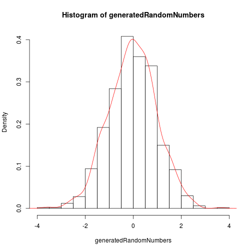

## Shiny
Shiny allows to deploy web application from R.
This is one of easiest methods to deploy applications without much web development knowledge

--- .class #id 

## Basic Elements

For deploying application following are requirements.
1. Install shiny libraries.
2. Create two files 
    a) server.R
    b) ui.R
One very simple shiny application can be accessed from 
https://hypoth.shinyapps.io/shinyExp

Required code for server.R and ui.R is available at
https://github.com/hypoth/shinyExp

---

## Basic R files needed
### server.R
This file is working to respond to various requests from client and process data based on these requests.

There is some reactive code, which basically respond to every change in input from the client using application.

#### ui.R
This file shows the basic page which has to be presented to the user. Based on users actions on this page the server.R has to 
respond with required data processing and possible reply to user.

--- 

## Experimental shiny Application
A small shiny applicatioin as deployed at https://hypoth.shinyapps.io/shinyExp to demonstrate basic working.

#### Purpose
This application show how random number generation function 'rnorm' behave by generating 1000 random number for each user input.

#### UI
User interface has two sliders for selecting mean and sd to be supplied to rnorm function.
based on this random numbers are generated.
there is button to reset seed.

---

## Basic R code on server.R

```r
      generatedRandomNumbers <- rnorm(1000, 0, 1)
      hist(generatedRandomNumbers,probability=TRUE)
      lines(density(generatedRandomNumbers),col="red")
```

 

---


## Results shown  to user (client)

Once these numbers are generated, distribution of these is shown to user as highligheted by plot in previous slide. This application shows effect of changing sigma on distribution. Difference between expected and calculated mean and sd is also shown.
